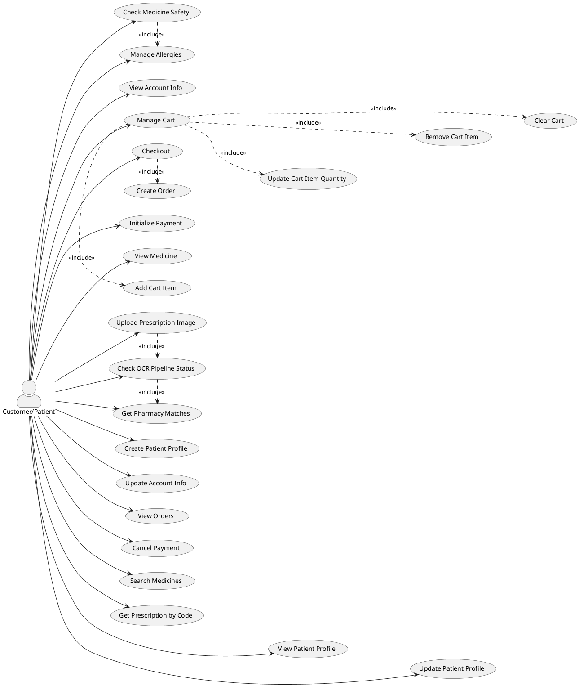
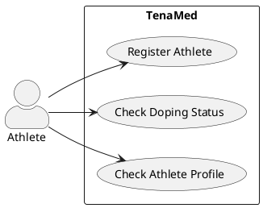
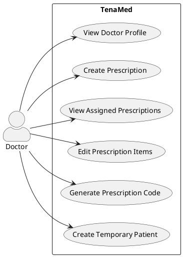
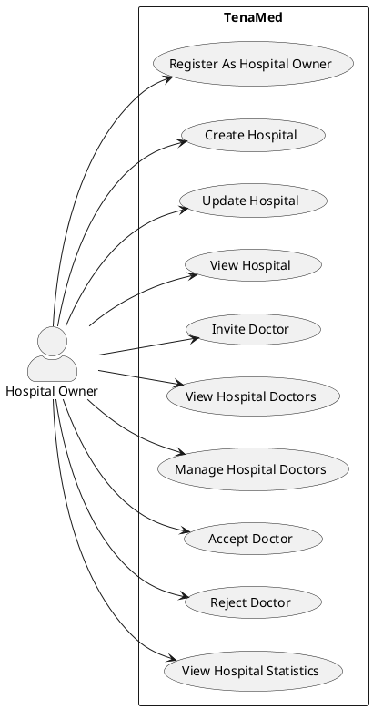
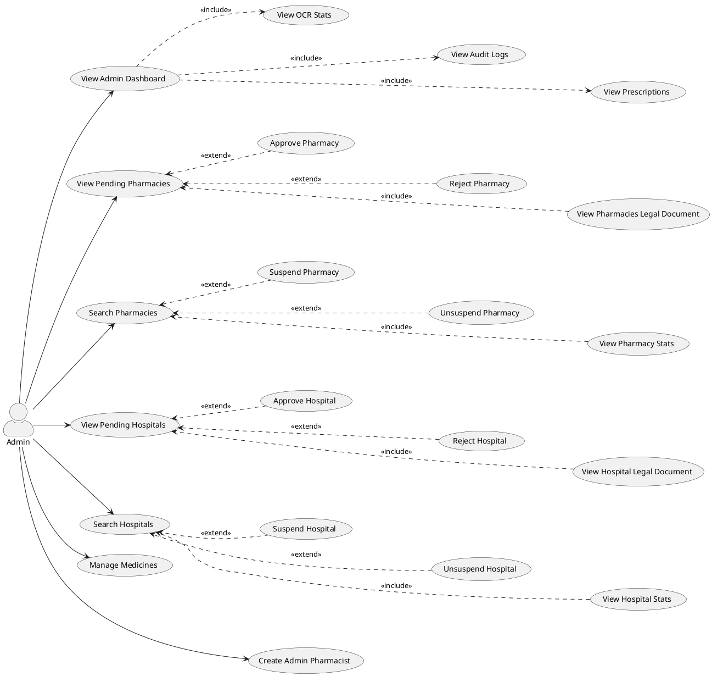
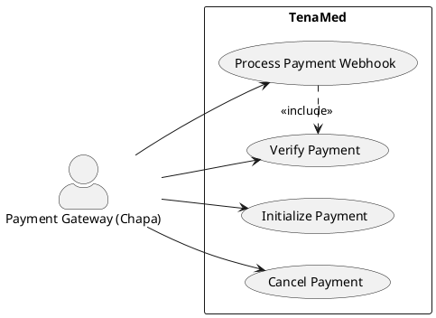
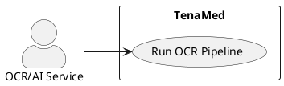
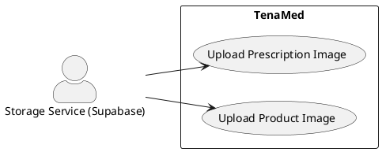
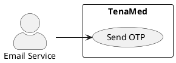

# TenaMed Use Case Diagrams (Per Actor)

## Guest
@startuml
left to right direction
skinparam actorStyle awesome

actor Guest

rectangle "TenaMed" {
  (Register As a Hospital Owner)
  (Register As a Pharmacist)
  (Register As an Athlete)
  (Register As a customer)
  (Register As a doctor)
  (Login)
  (Verify OTP)
  (View Invitation)
  (View Medicine)
  (Search Medicines)
}

Guest --> (Register As a Hospital Owner)
Guest --> (Register As a Pharmacist)
Guest --> (Register As an Athlete)
Guest --> (Register As a customer)
Guest -->  (Register As a doctor)
Guest --> (Login)
Guest --> (Verify OTP)
Guest --> (View Invitation)
Guest --> (View Medicine)
Guest --> (Search Medicines)
@enduml

## Customer/Patient

## Athlete

## Doctor

## Hospital Owner

## Pharmacy Owner

@startuml
left to right direction
skinparam actorStyle awesome
skinparam shadowing false
skinparam packageStyle rectangle

actor "Pharmacy Owner" as PharmacyOwner

(Create Pharmacy) as UC1
(View Pharmacy) as UC2

(Invite Pharmacist) as UC3
(Add Staff) as UC4
(List Staff) as UC5
(Verify Staff) as UC6

(View Pharmacy Orders) as UC7
(Accept Order) as UC8
(Reject Order) as UC9

(Create Inventory) as UC10
(Add Inventory Batch) as UC11
(Edit Inventory Batch) as UC12
(Delete Inventory Batch) as UC13

(Dispatch Delivery) as UC14
(Mark Delivered) as UC15
(Mark Delivery Failed) as UC16

/' ---------------- ACTOR LINKS ---------------- '/

PharmacyOwner --> UC1
PharmacyOwner --> UC2

PharmacyOwner --> UC3
PharmacyOwner --> UC4
PharmacyOwner --> UC5
PharmacyOwner --> UC6

PharmacyOwner --> UC7
PharmacyOwner --> UC8
PharmacyOwner --> UC9

PharmacyOwner --> UC10
PharmacyOwner --> UC14

/' ---------------- RELATIONSHIPS ---------------- '/

UC4 .> UC5 : <<include>>
UC6 .> UC5 : <<extend>>

UC8 .> UC7 : <<extend>>
UC9 .> UC7 : <<extend>>

UC10 .> UC11 : <<include>>
UC10 .> UC12 : <<include>>
UC10 .> UC13 : <<include>>

UC15 .> UC14 : <<extend>>
UC16 .> UC14 : <<extend>>

/' ---------------- HORIZONTAL ALIGNMENT ---------------- '/

UC1 -[hidden]right-> UC3
UC3 -[hidden]right-> UC7
UC7 -[hidden]right-> UC10
UC10 -[hidden]right-> UC14

UC4 -[hidden]down-> UC5
UC5 -[hidden]down-> UC6

UC11 -[hidden]down-> UC12
UC12 -[hidden]down-> UC13

UC15 -[hidden]down-> UC16

@enduml

## Pharmacist

@startuml
left to right direction
skinparam actorStyle awesome

actor Pharmacist

rectangle "TenaMed" {
  (Accept Order)
  (Reject Order)
  (View Inventory List)
  (View Batch Details)
  (View Deliveries)
}

Pharmacist --> (Accept Order)
Pharmacist --> (Reject Order)
Pharmacist --> (View Inventory List)
Pharmacist --> (View Batch Details)
Pharmacist --> (View Deliveries)
@enduml

## Admin Pharmacist

@startuml
left to right direction
skinparam actorStyle awesome
skinparam shadowing false
skinparam packageStyle rectangle

actor "Admin Pharmacist" as AdminPharmacist

(View Review Tasks) as UC1
(Claim Review Task) as UC2
(Complete Review Task) as UC3
(Reject Prescription) as UC4

/' ---------------- ACTOR LINKS ---------------- '/

AdminPharmacist --> UC1
AdminPharmacist --> UC2
AdminPharmacist --> UC3
AdminPharmacist --> UC4

/' ---------------- RELATIONSHIPS ---------------- '/

UC2 .> UC1 : <<extend>>
UC3 .> UC2 : <<include>>
UC4 .> UC2 : <<extend>>

/' ---------------- HORIZONTAL ALIGNMENT ---------------- '/
UC2 -[hidden]left-> UC3
UC1 -[hidden]right-> UC2

UC3 -[hidden]right-> UC4

@enduml

## Admin

## Payment Gateway (Chapa)

## OCR/AI Service

## Storage Service (Supabase)

## Email Service

